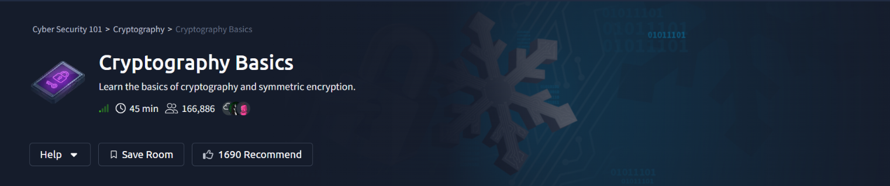
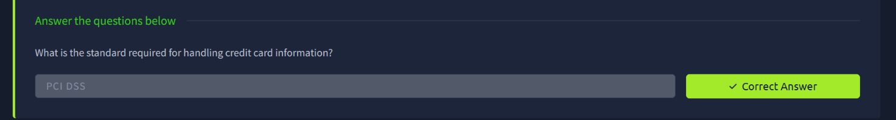
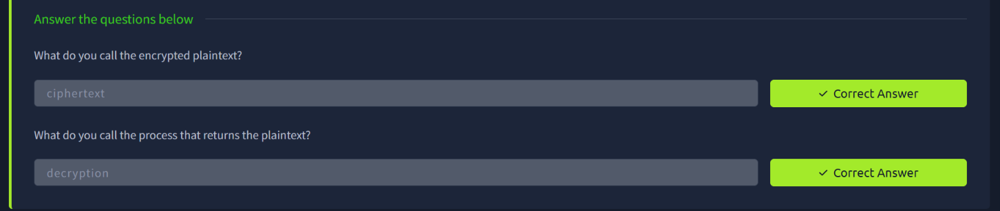
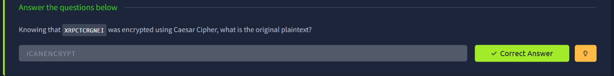
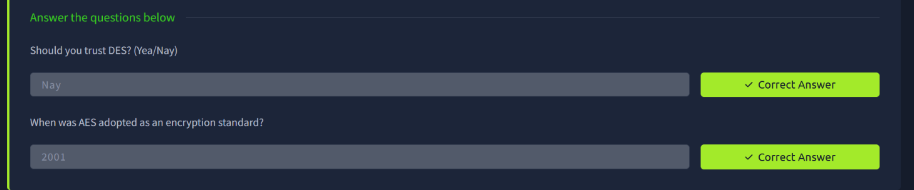
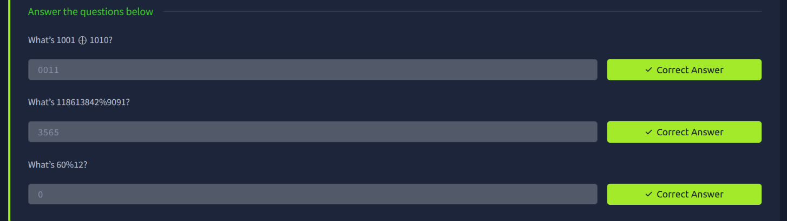

# TryHackMe — Cryptography Basics

## Room Info

| | |
|---|---|
| **Room** | [Cryptography Basics](https://tryhackme.com/room/cryptographybasics) |
| **Path** | Cyber Security 101 → Cryptography → Cryptography Basics |
| **Difficulty** | Info / Beginner |
| **Time** | ~45 min |
| **Category** | Cryptography Fundamentals |

## Room Description

This room introduces the foundations of cryptography and symmetric encryption — why encryption matters in regulated contexts, core terminology (plaintext/ciphertext/encryption/decryption), a classic Caesar Cipher exercise, the historical weaknesses of DES versus AES, and the bitwise/modular math (XOR, modulo) that underpins how modern ciphers actually work.

---

## Task — Why Cryptography Matters

Certain industries are legally required to protect sensitive data using well-defined cryptographic and security standards — credit card processing being a classic example.

**Q: What is the standard required for handling credit card information?**
`PCI DSS`

---

## Task — Core Cryptography Terminology

Before diving into any cipher, this task established the vocabulary used throughout the rest of the room: plaintext becomes **ciphertext** through encryption, and the reverse process that recovers the original plaintext is **decryption**.

**Q: What do you call the encrypted plaintext?**
`ciphertext`

**Q: What do you call the process that returns the plaintext?**
`decryption`

---

## Task — Caesar Cipher: Practical Decryption

The Caesar Cipher shifts every letter of the plaintext by a fixed number of positions in the alphabet. Decrypting it (without knowing the shift value in advance) just means trying each of the 25 possible shifts until the output reads as valid English — a textbook brute-force approach given the tiny keyspace.

**Approach:** Brute-forced all possible shift values against the ciphertext `XRPCTCRGNEI` until a readable plaintext emerged.

**Q: Knowing that `XRPCTCRGNEI` was encrypted using Caesar Cipher, what is the original plaintext?**
`ICANENCRYPT`

---

## Task — DES vs. AES: Trusting the Right Standard

DES (Data Encryption Standard) uses a 56-bit key, which is far too small by modern standards and has been broken via brute force for decades — it should no longer be trusted for anything sensitive. AES (Advanced Encryption Standard) replaced it and remains the current, trusted standard.

**Q: Should you trust DES? (Yea/Nay)**
`Nay`

**Q: When was AES adopted as an encryption standard?**
`2001`

---

## Task — The Math Behind Encryption: XOR & Modulo

Modern ciphers lean heavily on two simple operations: **XOR** (bitwise exclusive-or, which flips bits where inputs differ) and **modulo** (the remainder after division). Both are cheap to compute and, in the case of XOR, trivially reversible with the same key — which is exactly why they show up everywhere in symmetric cryptography.

**Q: What's `1001 ⊕ 1010`?**
`0011`

**Q: What's `118613842 % 9091`?**
`3565`

**Q: What's `60 % 12`?**
`0`

---

## Summary

| Task | Concept | Key Takeaway |
|---|---|---|
| Why cryptography matters | PCI DSS | Regulatory standards mandate encryption for sensitive data (e.g. card data) |
| Terminology | Plaintext / ciphertext / decryption | The vocabulary used throughout all cryptography topics |
| Caesar Cipher | Classical substitution cipher | Tiny keyspace (25 shifts) makes brute-forcing trivial |
| DES vs. AES | Symmetric cipher standards | DES's 56-bit key is broken; AES (2001) is the current trusted standard |
| XOR & modulo | Bitwise / modular arithmetic | The low-level math operations that make symmetric encryption work |

**Key takeaway:** This room laid the conceptual groundwork for everything that follows in the Cryptography path — the vocabulary, why encryption is legally mandated in some contexts, a hands-on feel for how weak classical ciphers fall apart under brute force, and the specific bitwise/modular math (XOR, modulo) that real symmetric algorithms like AES build on. Understanding *why* DES is deprecated and *how* XOR actually works makes the more advanced cryptography rooms much easier to reason about.

---
*Part of my [Cyber Security 101](https://tryhackme.com/path/outline/cybersecurity101) TryHackMe learning path.*
